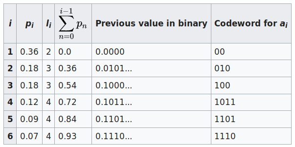

# Objective

Understand Shannon coding by implementing
an application in C for creating Shannon codes.

# Theoretical notions

See lecture notes for details on the Shannon coding algorithm.

As a quick remainder, check the [Shannon coding example from Wikipedia](https://en.wikipedia.org/wiki/Shannon_coding)

{width=80%}

# Exercises

2. Write a C program that creates a Shannon code from an input data file.
The program shall be called as follows: 

	`ShannonCode.exe input.txt code.dat`
	
    * The arguments are:
        * `input.txt`: the input file, from which the code is created
        * `code.dat`: the output file containing the Shannon code created (known as the "codebook" file).
        It shall contain a vector of 256 elements of the `CODE32BIT` structure type
        also used in the previous laboratories.

    * The program will follow the following steps:
        * Declare a vector with 256 elements of the `CODE32BIT` structure type
        * Read the input file and compute the probabilities of every character, just like it was done in lab L02 (copy that code)
        * Do Shannon coding:
          * Sort the probabilities vector in descending order
          * Create the cumulative probabilities vector
          * Compute the length of each codeword, `len`
          * For every cumulative value, find the first `len` bits of its binary value and store them in the codeword
        * Display the codewords for all characters
        * Save the codeword vector to the output file

2. Check the displayed codewords. Is it an instantaneous code or not?
    
# Final questions

1. TBD
2. TBD

